## `Linux`开发环境搭建

操作系统：**Ubuntu Server 18.04.3 LTS**

`Ubuntu 20`以后的秘钥加密算法做了调整，`SecureCRT 7`以前的版本都无法连接，所以本文以`Ubuntu 18.04.3 LTS`版本作为基本环境。笔者将使用`vmware`安装一个全新环境，从零开始演示开发环境如何搭建。

### 1、使用`vmware`安装`ubuntu server 18.04.3 LTS`镜像

镜像可以从**共享资源**中直接下载

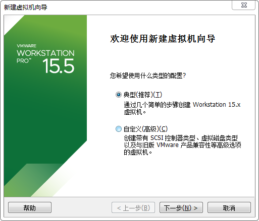

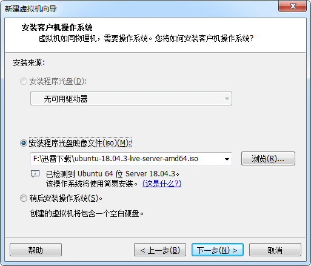

### 2、虚拟机创建成功以后，自动开启，进入安装界面，然后一路默认

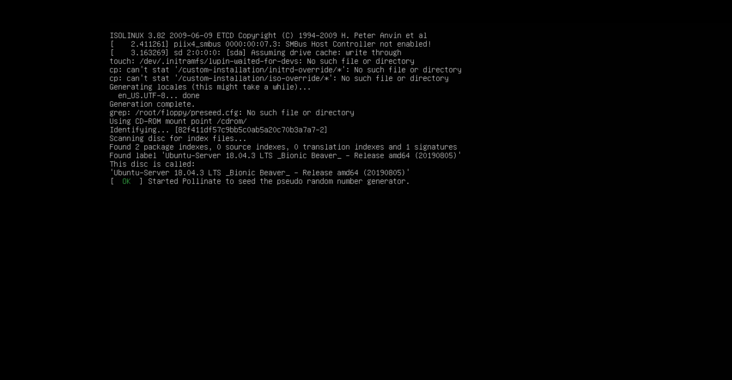

### 3、到了源配置界面，一定要把镜像改为国内镜像！

这个很重要！不然安装特别慢！

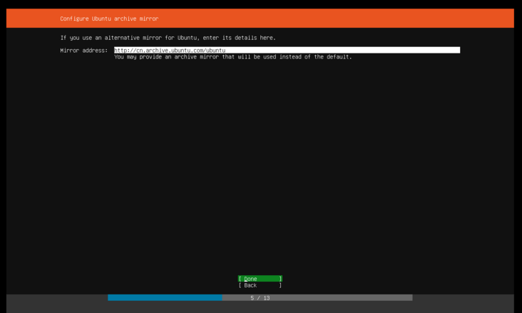

**推荐使用阿里云的源http://mirrors.aliyun.com/ubuntu**

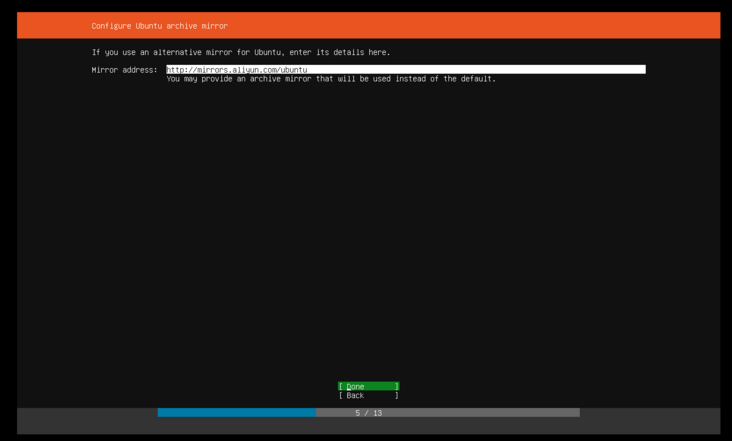

### 4、到了SSH配置界面，一定要选择`SSH server`，不然会无法使用`putty`或`SecureCRT`

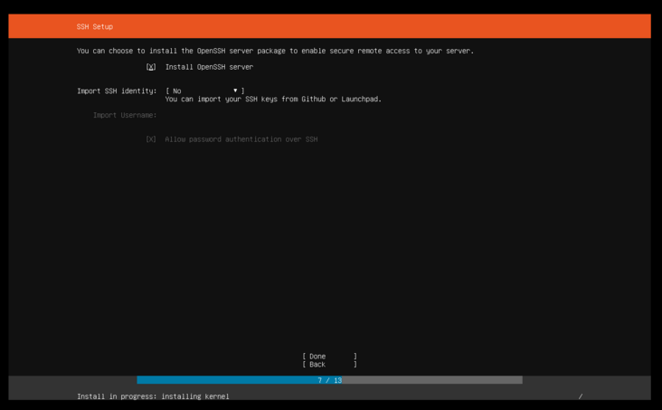

### 5、到了组件选择界面，不用安装多余的组件，直接`done`
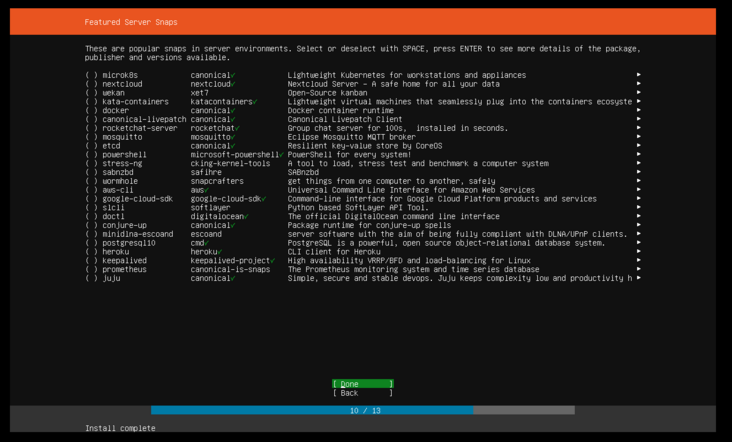

### 6、进入最后流程
这里会有安全升级，可能耗时较长（如果前面没有配置国内镜像，这里的时间更是数倍）,也可以跳过安全升级
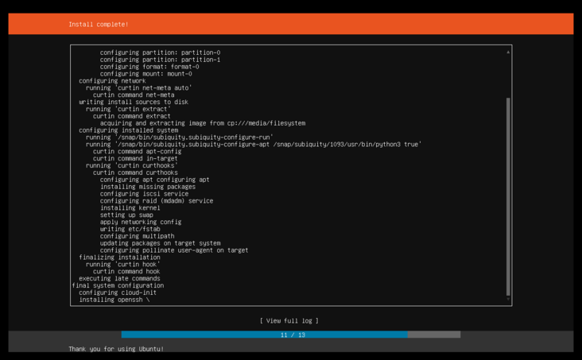

### 7、重启之后，进入控制台
如果使用`SecureCRT`连接，在`vmware`中可以看一下虚拟机的ip地址，然后配置连接地址和账号密码进行连接
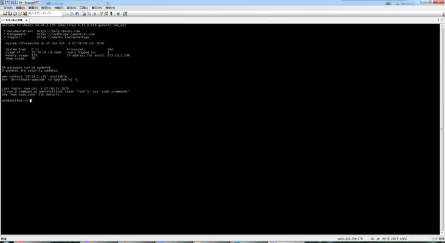

### 8、安装开发环境

```shell
$ sudo apt-get install build-essential
```

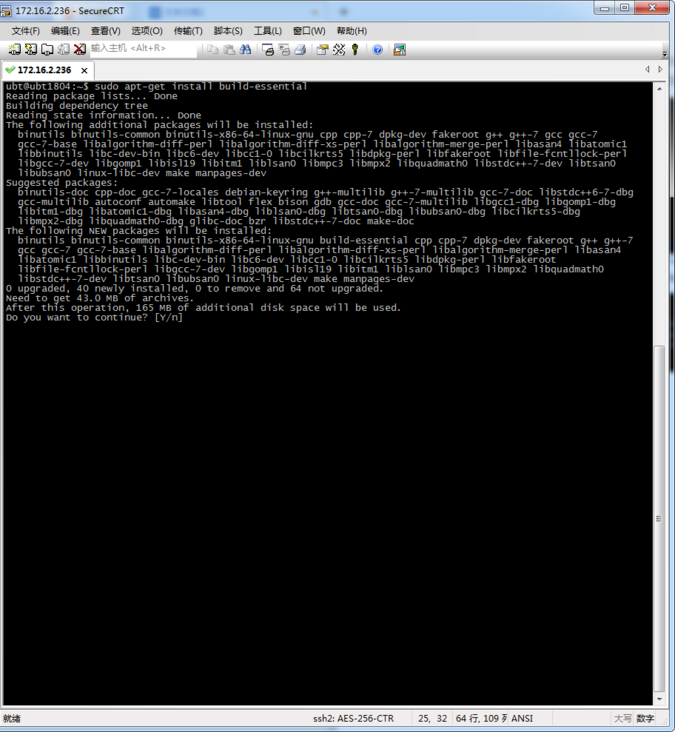

使用`gcc --version`查看`gcc`的版本号

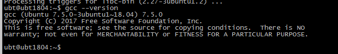

安装`cmake`

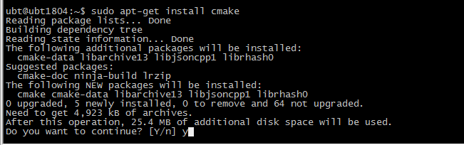

使用`cmake --version`查看`cmake`的版本号

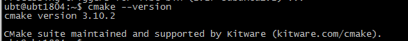

安装7z解压工具

```shell
$ sudo apt-get install p7zip-full
```

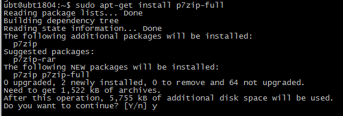

### 9、从`共享资源`中下载`mydes_linux.7z`并上传到虚拟机

可以使用使用`SecureFX`（**共享资源**中的`SecureCRT`自带`SecureFX`）上传到虚拟机，如下图：

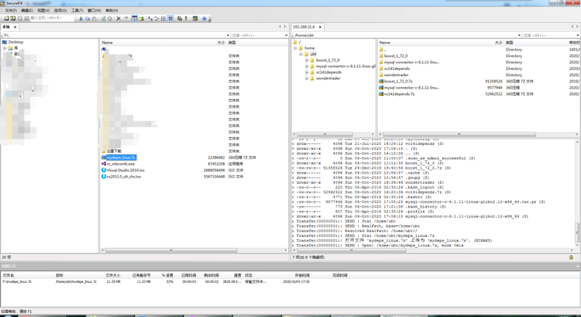

### 10、将`mydeps_linux.7z`解压到`/home`下

```shell
$ sudo 7z x mydeps_linux.7z /home
```

### 11、拉取`WonderTrader`的源码

```shell
$ sudo git clone https://github.com/wondertrader/wondertrader.git
```

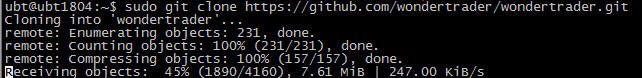

### 12、进入`src`目录，执行编译脚本

```shell
$ sudo ./build_release.sh
```

编译完成以后，使用`SecureFX`就可以直接从`src`目录下的`build/bin`中下载需要的文件即可

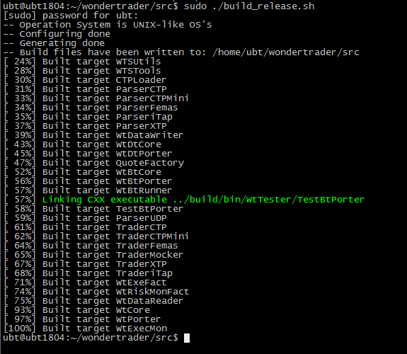
