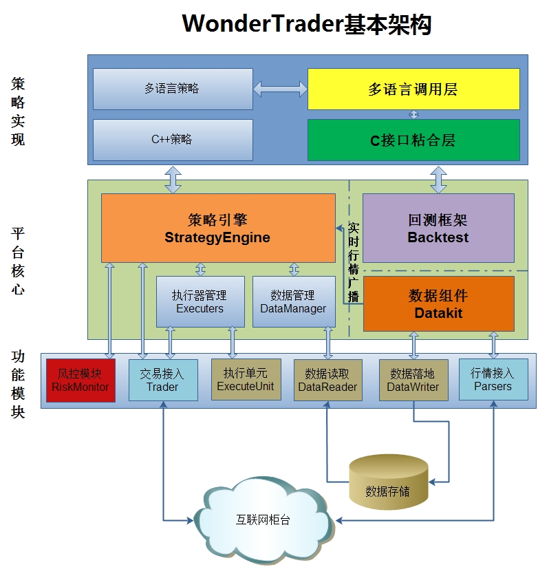

# 基本架构

## 组件研究

作者将架构分为三个主要部分：

- 开放给策略研发人员的**策略实现部分**
- 实盘回测的具体框架组成**平台核心部分**
- 具体实现每个功能的**功能模块部分**

那么，WT是如何利用上述架构和模组，解决种种问题的呢，解决每个问题的关键角色又是哪个模块呢？

## 信号与交易如何解耦

交易可以理解为信号的具体执行，主要由执行器**Executers**实现，策略计算并发出信号后，交給执行器转换为具体的开平交易订单，后发给**Trader**提交给交易柜台。WT通过将交易执行从策略中剥离，交給**Executers**执行，策略仅计算生成信号，从而实现了信号与交易解耦。

## 策略组如何实现

策略组的目的是为了实现多账户多策略的管理，需要做到以下几点：

- 多个账户如何管理？
  - 多账户一方面要求相同的策略能够把信号分发到不同的账户中，这一点应该是由交易通道**Trader**实现的，通过交易通道将交易的开平指令分发给不同的账户。
- 多个策略如何管理？
  - 多个策略各自管理自己的账户，有独立的账本，可以记录各自的持仓，这是在**StrategyEngine**中实现的。
- 如何避免自成交
  - 同一个账户下的多个策略交易同一个标的时，当同时发出相反信号时，可能会出现自成交。在**StrategyEngine**中，会将各个策略的信号和头寸进行汇总、轧平后转换为净持仓交易后才交给执行器，从而避免自成交的情况。
- 数据如何分发给多个策略？
  - 每个策略分开订阅明显不合适，会大大增加系统的负荷，通过数据组件**DataKit**来统一执行行情订阅、存储以及分发的功能。

## 风控如何管理

通过专门的**RiskMonitor**监控每个账户的具体情况，能够方便的设置风控规则进行管理。通过外部的配置文件来设置风控指标，而在策略中则完全不需要考虑账户的风控管理。

## 研究与实盘如何一致

WT做了以下处理来保证研究和实盘的一致：

- 在**多语言调用层**保证所有接口名称、参数、返回值一致。
- 在**回测框架**中，委托成交不仅要求价格上穿委托价外，成交的笔数会受到盘口挂单量的影响。相较于最新价+滑点的撮合方式，加入盘口的考量能够将流动性的影响加入进来，使得回测的绩效更加贴近实盘。

## 推荐阅读

- [WonderTrader架构详解之一——整体架构](https://mp.weixin.qq.com/s/hGr-NZk1l3BRg5aTTKQP8g)
- [WonderTrader架构详解之二——从数据说起](https://mp.weixin.qq.com/s/i7de8G2A8RXRggMQ21vv1w)
- [WonderTrader架构详解之三——信号与执行](https://mp.weixin.qq.com/s/m1z6dKCVWXWNGU7R6KWwWw)
- [WonderTrader架构详解之四——浅谈平台对策略的支持](https://mp.weixin.qq.com/s/Ov9qbnf9kejeCds0akRvUQ)