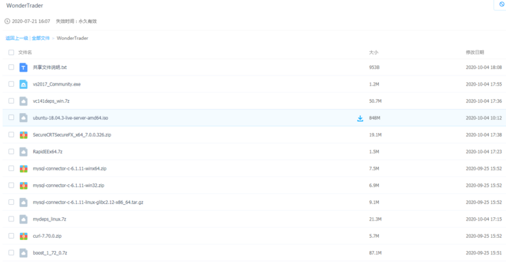

# 所需的资源

不像python能够通过pip轻松的获取三方库，许多库需要自己在网上查找，并且安装配置，好在作者已经将所有要用到的工具整理好了，不仅包括需要用到的三方库，而且还包括IDE和其他方便使用的工具。

下载链接: [https://pan.baidu.com/s/1Bdxh_PgjqHMzuGjl9ernhg](https://pan.baidu.com/s/1Bdxh_PgjqHMzuGjl9ernhg)

提取码: d6bh

