## `Windows`开发环境搭建

### 1、安装`vs2017`社区版

首先下载`vs2017`的安装器，下载地址如下：
[https://visualstudio.microsoft.com/zh-hans/vs/older-downloads/](https://visualstudio.microsoft.com/zh-hans/vs/older-downloads/)

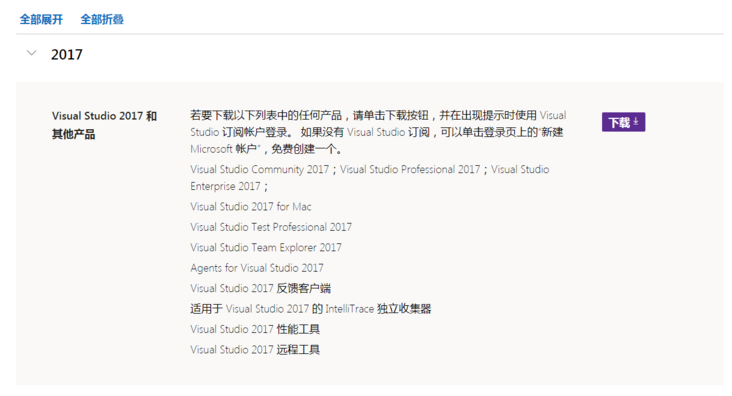

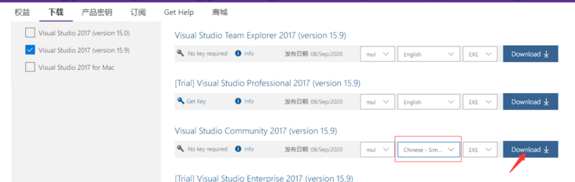

或者直接从**共享资源**中直接下载该安装器

### 2、从`共享资源`中下载`vc141deps_win.7z`，并解压到`E:/vc141depends`目录(目录可以更改，后面设置时同步更改即可)

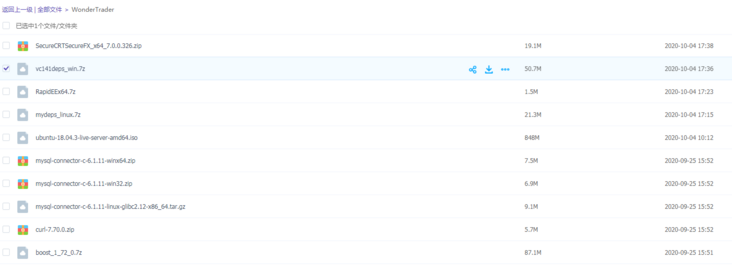

### 3、配置环境变量

从**共享资源**中下载环境变量编辑器`RapidEE`到本地，解压以后运行。
新建一个名为`MyDepends141`的环境变量，并将值设置为依赖库解压目录`E:/vc141depends`

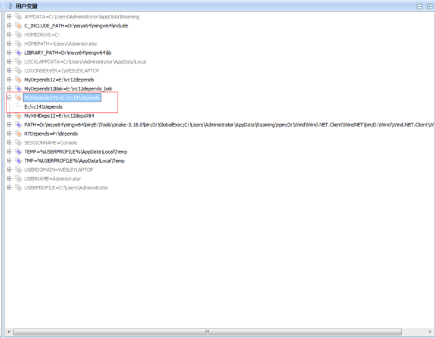

设置好了以后，保存环境变量，即可生效，如果没有生效，可以重启电脑。`win10`下要注意一下使用**管理员身份运行**`RapidEE`，不然保存可能会失败！

```tip
使用windows设置-高级系统设置-环境变量-设置用户变量可以达到同样的效果
```

### 4、安装`git`

下载git并安装：[https://git-scm.com/download/win](https://git-scm.com/download/win)

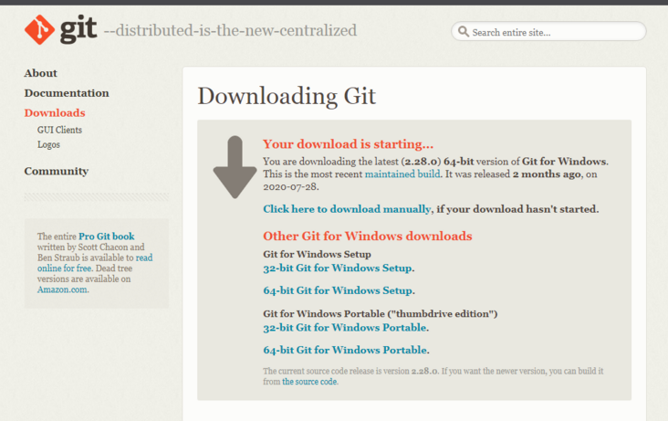

下载tortoisegit并安装：[https://tortoisegit.org/download/](https://tortoisegit.org/download/)

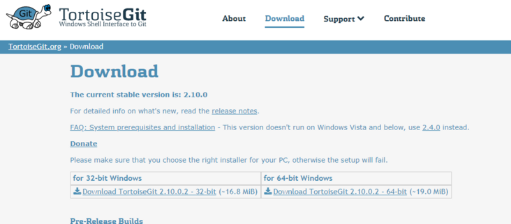

### 5、下载代码

选择一个目录，然后右键点击该目录，选择“**Git克隆**”菜单

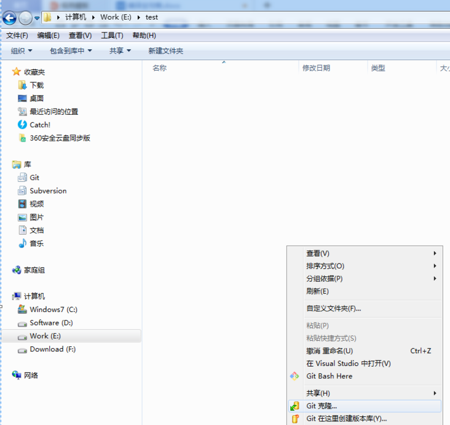

URL设置为:<https://github.com/wondertrader/wondertrader.git>


希望能够参与到项目中的朋友，可以自行百度如何使用git提交`pull requests`

### 6、编译代码

进入到`wondertrader`的`src`目录下

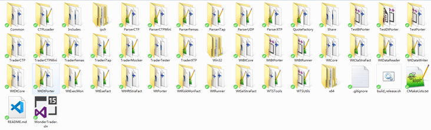

双击运行`wondertrader.sln`，打开以后在解决方案上右键点击，选择“**生成解决方案**”就进入了编译过程

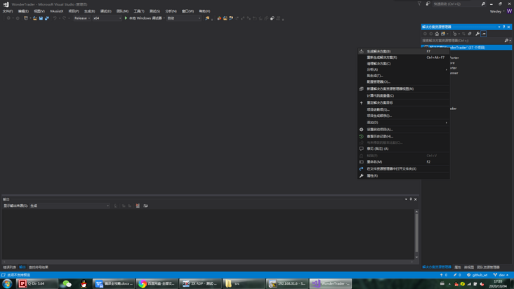


```tip
若使用其他版本的VS（比Vs2017版本更高的）进行编译，需要注意不要进行项目重定向，不要更改平台工具集，保持在Visual Studio 2017(v141)
```

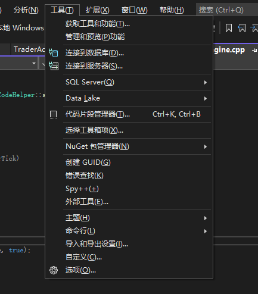

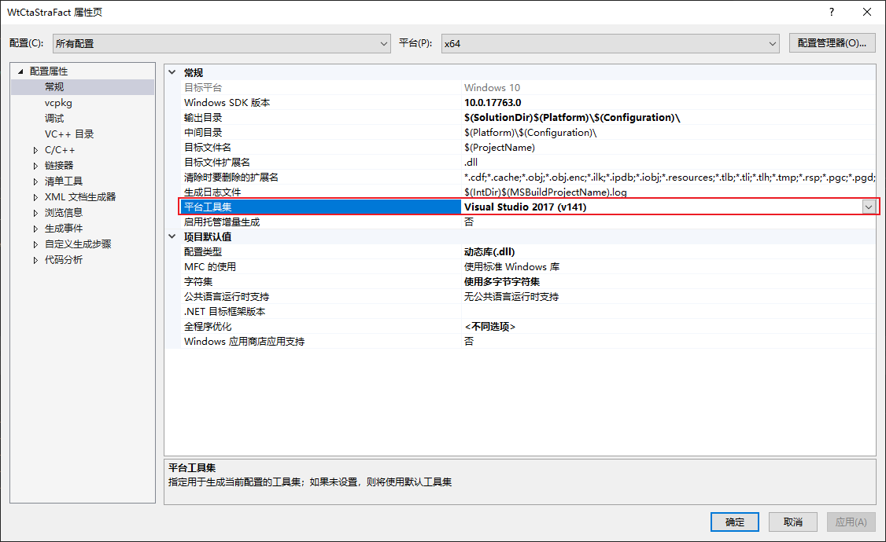

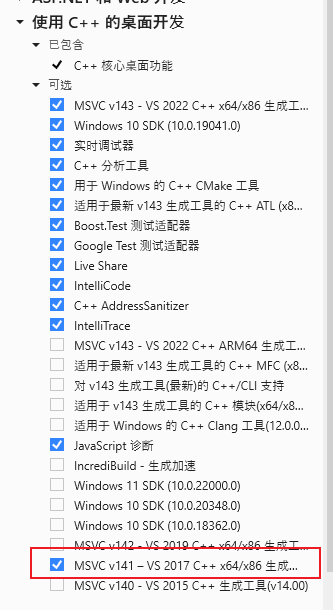