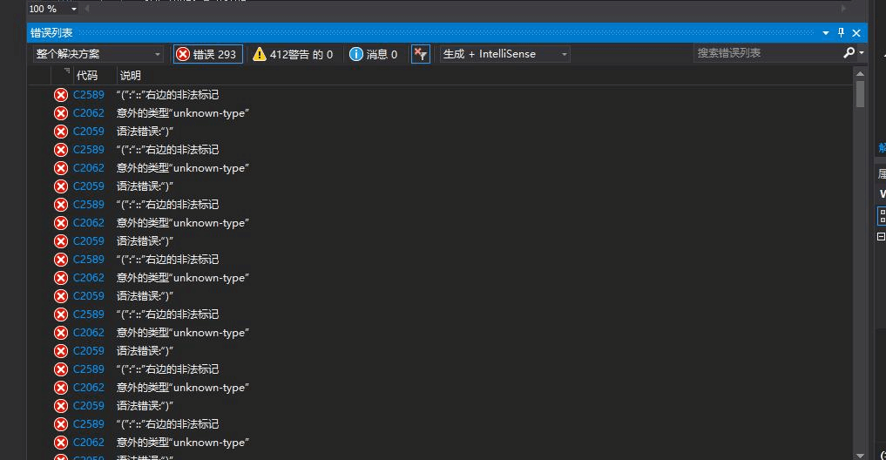
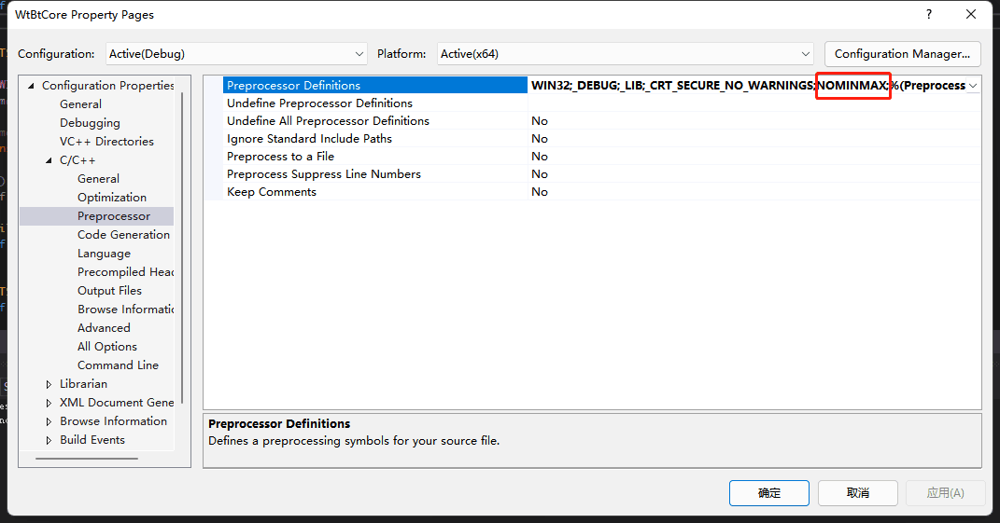
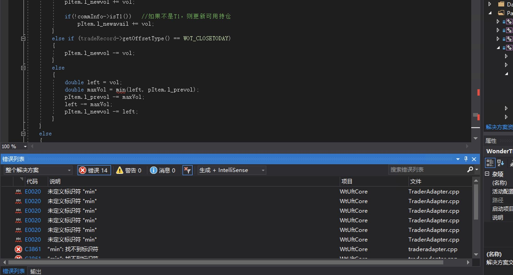
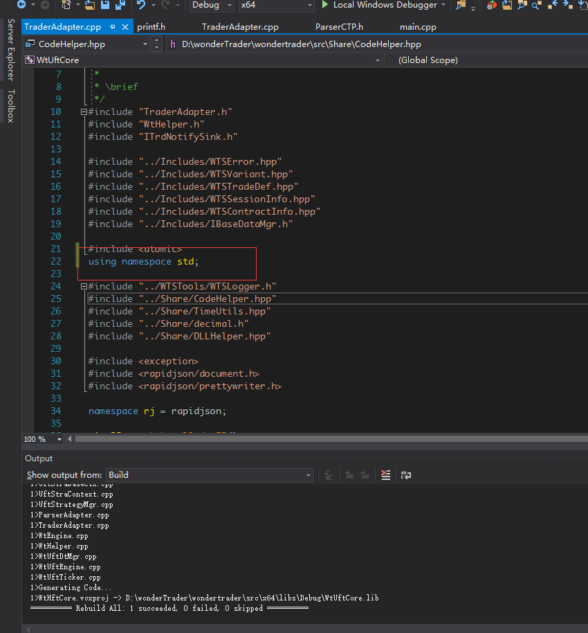

# 编译问题

## 1. C2589 "(":"::"右边的非法标记

1. 报错内容



2. 解决方案



```note
Visual C++ 在windows下min和max与<windows.h>中传统的min/max宏定义有冲突。会导致无法使用。为了禁用Visual C++中的 min/max宏定义，可以在包含<windows.h>头文件之前加上：NOMINMAX，或者在预处理中添加。
```

## 2. wtuftcore这个项目报未定义标识符错误

1. 报错内容


2. 解决方案

在TraderAdapter.cpp添加using namespace std;即可



