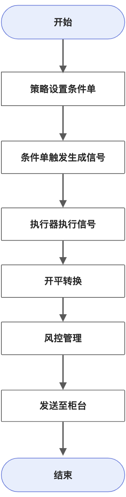

# 概念问题

## 信号与执行

信号可以理解为是一种**要求**，即策略要求在某种情况下，账户需要要达到某种持仓状态，而执行便是具体使仓位符合要求的一系列具体动作，包括包括发单、撤单、追单等等。

在vnpy或掘金等事件驱动类型的交易品台中，策略开发者需要同时管理信号与执行，而WT则将信号与执行进行了解耦，策略仅负责信号的计算与发出，具体的执行由执行器负责。具体流程如下(图片由@Praying绘制)：



1. 策略通过[交易接口](../开发手册/WTPY/交易引擎/1.CTA引擎/上下文.md#交易接口)设置条件单
2. 当检测到条件单触发后，生成了交易**信号**
3. 信号被传递给执行器执行
4. 执行器中将信号通过开平规则，转换为具体的交易订单
5. 进行风控管理，内部拒绝部分危险订单
6. 发送至柜台
7. 直到仓位达到信号**要求**后，执行器任务结束。

```tip
以内置的WtMinImpactExeUnit（最小冲击执行单元）为例，只需要告诉执行器需要达到的目标持仓即可，内部会自动进行发单，追单，撤单等操作。
```

