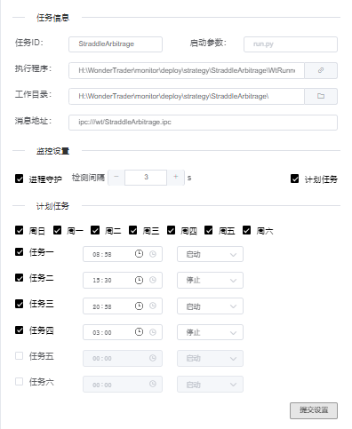

# WtMonSvr

对应demo地址[WtMonSvr](https://github.com/wondertrader/wtpy/tree/master/demos/test_monitor)

WtMonSvr是一个强大的控制台程序，提供实盘监控，自动调度，在线回测等功能。通过WtMonSvr，可以方便的设置程序的定时启动，配合[datakit](../../WTPY/3.工具集/datakit.md),[hotpicker](../../WTPY/3.工具集/hotpicker.md),[ctp_loader](../../WTPY/3.工具集/ctp_loader.md)等工具，可以实现数据、配置的自动更新。

## 启动服务

WtMonSvr的启动代码如下：

```python
from wtpy.monitor import WtMonSvr, WtBtMon
from wtpy import WtDtServo

dtServo = WtDtServo()
# 配置基础文件
dtServo.setBasefiles(commfile="../common/commodities.json", 
                contractfile="../common/contracts.json", 
                holidayfile="../common/holidays.json", 
                sessionfile="../common/sessions.json", 
                hotfile="../common/hots.json")
dtServo.setStorage("../storage/")
dtServo.commitConfig()

# 设置部署文件夹，需要绝对路径
svr = WtMonSvr(deploy_dir="代码所在目录/deploy")
# 设置回测监控文件夹，需要绝对路径
btMon = WtBtMon(deploy_folder="代码所在目录/bt_deploy", logger=svr.logger)
svr.set_bt_mon(btMon)
svr.set_dt_servo(dtServo)
# 启动的端口
svr.run(port=8099, bSync=False)
input("press enter key to exit\n")
```

```tip
demo中部署和回测监控文件夹，均需要使用绝对路径，如果没有改文件夹，则需要自己新建一个
```

运行后，浏览器中输入[http://127.0.0.1:8099/console](http://127.0.0.1:8099/console)进入控制台

账户名为superman，密码为Helloworld!


登录后，可以自行更改密码，或添加用户


## 添加策略组合

在控制台-监控中心中，可以添加策略组合


组合配置中消息地址需要与自己配置文件中的消息地址一致，否则控制台无法接收到信息


添加成功后，点击调度，可是设置任务调度信息。


## 添加调度

在调度中心中可以设置调度，调度即设置启动的相关信息，如工作目录，启动代码名，用哪个python启动，何时启动，是否开启进程守护等。


工作目录为代码所在目录，进程守护即是否在判断程序中断后，自动重启，检测间隔则未检查程序是否中断的间隔，计划任务为是否定时启动、停止、重启等调度设置。

对于python程序，在启动参数中，设置需要启动的python脚本，执行程序设置为用于执行的python解释器


而cpp程序则不用设置启动参数，只需要把执行程序设置为可执行程序就可以



```tip
对于任务信息的设置，可以这么理解，实际上就是通过cmd执行一个如下命令
cd %工作目录
%执行程序 %启动参数
```